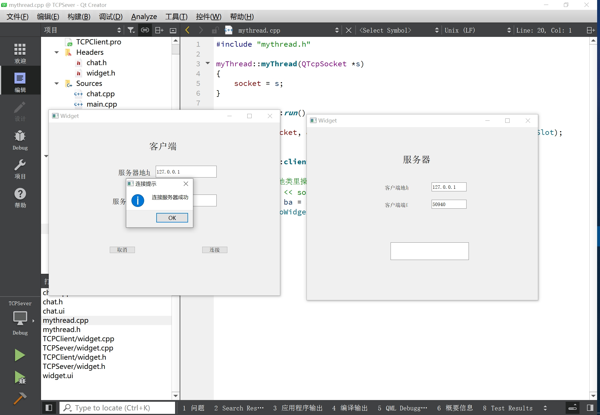
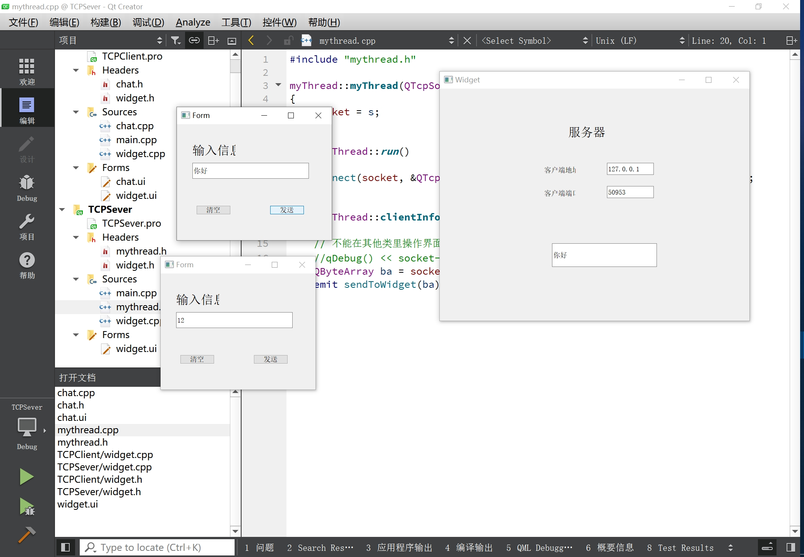

# TCP客户端&服务端QT开发

> TCP（传输控制协议）是大多数互联网协议（包括HTTP和FTP）用于数据传输的低级网络协议。它是一个**可靠的**、**面向流的**、**面向连接的**传输协议。它特别适合数据的连续传输。

# TCP Client

## 1.Widget类写UI界面，创建socket对象

> QTcpSocket类为TCP提供了一个接口。您可以使用QTcpSocket来实现标准网络协议，如POP3、SMTP和NNTP，以及自定义协议。

```c++
Widget::Widget(QWidget *parent)
    : QWidget(parent)
    , ui(new Ui::Widget)
{
    ui->setupUi(this);

    socket = new QTcpSocket;    //创建socket对象
}
```

## 2.取消按键槽函数

```c++
// 直接关闭窗口即可
void Widget::on_cancelButton_clicked()
{
    this->close();
}
```

## 3.连接按键槽函数

### 3.1获取ip和port

> 在开始任何数据传输之前，必须建立到远程主机和端口的TCP连接。

```c++
// 获取ip地址和端口号
QString ip = ui->ipLineEdit->text();
QString port = ui->portLineEdit->text();
```

### 3.2连接服务器

socket第一个参数，QString->QHostAddress；第二个参数QString->short.

> 一旦建立了连接，对等端的IP地址和端口就可以通过**QTcpSocket::peerAddress()**和**QTcpSocket::peerPort()**获得。
>
> 在任何时候，对等方都可以关闭连接，然后数据传输将立即停止。

```c++
// 连接服务器
socket->connectToHost(QHostAddress(ip), port.toShort());
```

### 3.3连接成功，发出信号

指向新页面，同时堆区创建指针，避免该进程结束后自动回收相关的成员函数和局部变量，同时传入socket变量进入chat类中。

> QTcpSocket异步工作，并发出信号报告状态更改和错误，就像QNetworkAccessManager一样。它依赖于事件循环来检测传入数据并自动刷新传出数据。您可以使用**QTcpSocket::write()**将数据写入套接字，并使用**QTcpSocket::read()**读取数据。QTcpSocket表示两个独立的数据流：一个用于读取，一个用于写入。

> 由于QTcpSocket继承了QIODevicece，因此可以将其与QTextStream和QDataStream一起使用。从QTcpSocket读取数据时，必须通过预先调用QTcpSocket:：bytesAvailable（）来确保有足够的数据可用。

```c++
// 连接服务器成功，socket对象发出信号
connect(socket, &QTcpSocket::connected, [this]()
{
    QMessageBox::information(this, "连接提示", "连接服务器成功");

    this->hide();
    Chat *c = new Chat(socket);     //堆空间创建
    c->show();
});
```

### 3.4连接失败，发出信号

```c++
// 连接一异常， socket发出信号
connect(socket, &QTcpSocket::disconnected, [this]()
{
    QMessageBox::warning(this, "连接提示", "连接异常，网络断开");
});
```

## 4.Chat类写UI界面，接收socket参数

构造函数，传入socket内容

```c++
###---chat.h---###
class Widget : public QWidget
{
    Q_OBJECT

public:
    Widget(QWidget *parent = nullptr);
    ~Widget();

private slots:
    void on_cancelButton_clicked();

    void on_connetButton_clicked();

private:
    Ui::Widget *ui;
    QTcpSocket *socket;
};

###---chat.c---###
Chat::Chat(QTcpSocket *s, QWidget *parent) :
    QWidget(parent),
    ui(new Ui::Chat)
{
    ui->setupUi(this);
    socket = s;
}
```

## 5.清空发送文本槽函数

```c++
void Chat::on_clearButton_clicked()
{
    ui->lineEdit->clear();
}
```

## 6.发送槽函数

socket->write()函数封装好了，要求发送数据为QByteArray格式。

```c++
void Chat::on_sendButton_clicked()
{
    QByteArray ba;
    ba.append(ui->lineEdit->text());
    socket->write(ba);
}
```

------

# TCP Sever

## 1.Widget类写UI界面，创建QTcpServer对象

> 如果需要处理传入的TCP连接（例如，在服务器应用程序中），请使用QTcpServer类。调用QTcpServer::listen()来设置服务器，并连接到QTcpServer::newConnection()信号，该信号为每个连接的客户端发出一次。

```c++
Widget::Widget(QWidget *parent)
    : QWidget(parent)
    , ui(new Ui::Widget)
{
    ui->setupUi(this);
    server = new QTcpServer;

    server->listen(QHostAddress::AnyIPv4, PORT);

    // 客户端发起连接， server发出信号
    connect(server, &QTcpServer::newConnection, this, &Widget::newClientHandler);
}
```

## 2.服务端处理槽函数

建立连接 ----> 启动线程(服务端多线程)，传入socket参数

> 在您的插槽中，调用QTcpServer::nextPendingConnection()接受连接，并使用返回的QTcpSocket与客户端通信。

> 尽管它的大多数功能都是异步工作的，但也可以同步使用QTcpSocket（即阻塞）。要获取阻塞行为，请调用QTcpSocket的waitFor...()功能；这些挂起调用线程，直到发出信号为止。例如，在调用非阻塞QTcpSocket:：connectToHost()函数后，调用QTcpSocket::waitForConnected()来阻塞线程，直到发出connected()信号。

> 同步套接字通常导致代码具有更简单的控制流。等待的主要缺点是waitfor...()方法是在等待时不会处理事件waitfor...()函数正在阻塞。如果在GUI线程中使用，这可能会**冻结应用程序的用户界面**。因此，我们建议您仅在**非GUI线程**中使用同步套接字。当同步使用时，QTcpSocket不需要事件循环。

```c++
void Widget::newClientHandler()
{
    // 建立TCP连接
    QTcpSocket *socket = server->nextPendingConnection();

    //socket->peerAddress();  //获取客户端地址
    //socket->peerPort(); //获取端口号

    ui->ipLineEdit->setText(socket->peerAddress().toString());
    ui->portLineEdit->setText(QString::number(socket->peerPort()));

    // 服务器收到客户端信息， socket发出readyread信号
    //connect(socket, &QTcpSocket::readyRead, this, &Widget::clientInfoSlot);

    // 启动线程
    myThread *t = new myThread(socket); //创建线程对象
    t->start();                        //开始线程

    connect(t, &myThread::sendToWidget, this, &Widget::threadSlot);
}
```

## 3.线程类

### 3.1初始化

```c++
myThread::myThread(QTcpSocket *s)
{
    socket = s;
}

void myThread::run()
{
    connect(socket, &QTcpSocket::readyRead, this, &myThread::clientInfoSlot);
}
```

### 3.2槽函数

```c++
void myThread::clientInfoSlot()
{
    // 不能在其他类里操作界面
    //qDebug() << socket->readAll();
    QByteArray ba = socket->readAll();
    emit sendToWidget(ba);      //发送信号，信号中带参数
}
```

### 3.3自定义信号

```c++
class myThread :  public QThread
{
    Q_OBJECT
public:
    explicit myThread(QTcpSocket *s);
    void run();

signals:
    void sendToWidget(QByteArray b);


public slots:
    void clientInfoSlot();

private:
    QTcpSocket *socket;

};
```

### 3.4显示槽函数

```c++
void Widget::threadSlot(QByteArray b)
{
    ui->mainLineEdit->setText(QString(b));
}
```

# 成果展示

连接：




多线程：




> [Fortune Client](https://doc.qt.io/archives/qt-5.14/qtnetwork-fortuneclient-example.html)和[Fortune Server](https://doc.qt.io/archives/qt-5.14/qtnetwork-fortuneserver-example.html)示例显示了如何使用QTcpSocket和QTcpServer编写TCP客户端-服务器应用程序。有关如何在单独的线程中使用同步QTcpSocket（不使用事件循环）的示例，请参阅[Blocking Fortune Client](https://doc.qt.io/archives/qt-5.14/qtnetwork-blockingfortuneclient-example.html)；有关每个活动客户端有一个线程的多线程TCP服务器的示例，则请参阅[Threaded Fortune Server](https://doc.qt.io/archives/qt-5.14/qtnetwork-threadedfortuneserver-example.html)。

# 参考：

1. QT5.14 官方Document
2. 学益得智能硬件