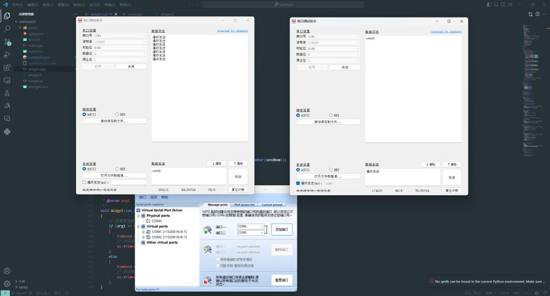

# uartQT

## 1. uartAssist.pro

添加如下两行

```c++
QT       +=  serialport
RC_ICONS = myIco.ico
```

## 2. 绘制UI界面

## 3. 初始化对象和私有变量

```c++
private:
    Ui::Widget *ui;

    QSerialPort *serialPort;

    long recvSizeNum, sendSizeNum;  //字节数
    int recvNum, sendNum;   //帧数
```

## 4. 主功能函数

### 4.1 初始化

```c++
Widget::Widget(QWidget *parent)
    : QWidget(parent)
    , ui(new Ui::Widget)
{
    ui->setupUi(this);

    serialPort = new QSerialPort;

    recvNum = 0;
    sendNum = 0;

    recvSizeNum = 0;
    sendSizeNum = 0;

    //  定时发送定时器
    timSend = new QTimer;
    connect(timSend, &QTimer::timeout, this, &Widget::on_sendButton_clicked);

    // 搜索可用串口，并添加到串口组合框
    ui->portComboBox->clear();

    foreach(const QSerialPortInfo &info, QSerialPortInfo::availablePorts())
    {
        ui->portComboBox->addItem(info.portName());
    }

    // 设置默认波特率：115200
    ui->baudRateComboBox->setCurrentIndex(7);
    // 设置默认校验位：无
    ui->parityComboBox->setCurrentIndex(0);
    // 设置默认数据位：8
    ui->dataBitComboBox->setCurrentIndex(3);
    // 设置默认停止位：1
    ui->stopComboBox->setCurrentIndex(0);

    // 接收/发送 默认设置 ASCII
    ui->recvASCIIRB->setChecked(true);
    ui->sendASCIIRB->setChecked(true);
}
```

### 4.2 打开串口

```c++
/**
 * @brief 打开串口按钮槽函数
 * 
 */
void Widget::on_openPortButton_clicked()
{
    // 串口名
    serialPort->setPortName(ui->portComboBox->currentText());
    
    // 打开串口成功
    if (serialPort->open(QIODevice::ReadWrite))
    {
        // 设置波特率
        switch (ui->baudRateComboBox->currentIndex())
        {
            case 0:serialPort->setBaudRate(QSerialPort::Baud1200);break;
            case 1:serialPort->setBaudRate(QSerialPort::Baud2400);break;
            case 2:serialPort->setBaudRate(QSerialPort::Baud4800);break;
            case 3:serialPort->setBaudRate(QSerialPort::Baud9600);break;
            case 4:serialPort->setBaudRate(QSerialPort::Baud19200);break;
            case 5:serialPort->setBaudRate(QSerialPort::Baud38400);break;
            case 6:serialPort->setBaudRate(QSerialPort::Baud57600);break;
            case 7:serialPort->setBaudRate(QSerialPort::Baud115200);break;
            default:break;
        }

        // 设置校验位
        switch (ui->parityComboBox->currentIndex())
        {
            case 0:serialPort->setParity(QSerialPort::NoParity);break;
            case 1:serialPort->setParity(QSerialPort::OddParity);break;
            case 2:serialPort->setParity(QSerialPort::EvenParity);break;
            default:break;
        }

        // 设置数据位
        switch (ui->dataBitComboBox->currentIndex())
        {
            case 0:serialPort->setDataBits(QSerialPort::Data5);break;
            case 1:serialPort->setDataBits(QSerialPort::Data6);break;
            case 2:serialPort->setDataBits(QSerialPort::Data7);break;
            case 3:serialPort->setDataBits(QSerialPort::Data8);break;
            default:break;
        }

        // 设置停止位
        switch (ui->stopComboBox->currentIndex())
        {
            case 0:serialPort->setStopBits(QSerialPort::OneStop);break;
            case 1:serialPort->setStopBits(QSerialPort::OneAndHalfStop);break;
            case 2:serialPort->setStopBits(QSerialPort::TwoStop);break;
            default:break;
        }

        // 设置流控制
        serialPort->setFlowControl(QSerialPort::NoFlowControl);

        // 关闭串口按钮使能
        ui->openPortButton->setEnabled(false);
        // comboBox失能
        ui->portComboBox->setEnabled(false);
        ui->baudRateComboBox->setEnabled(false);
        ui->parityComboBox->setEnabled(false);
        ui->dataBitComboBox->setEnabled(false);
        ui->stopComboBox->setEnabled(false);
        // 打开串口按钮失能
        ui->closePortButton->setEnabled(true);

        // 串口接收信号槽函数
        connect(serialPort, &QSerialPort::readyRead, this, &Widget::serialPortRecv);
    }
    else
    {
        QMessageBox::warning(this, "警告", "串口打开失败！");
    }
}
```

### 4.3 关闭串口

```c++
/**
 * @brief 关闭串口按钮槽函数
 * 
 */
void Widget::on_closePortButton_clicked()
{
    // 关闭串口
    serialPort->close();

    // 打开串口按钮使能
    ui->openPortButton->setEnabled(true);
    // comboBox使能
    ui->portComboBox->setEnabled(true);
    ui->baudRateComboBox->setEnabled(true);
    ui->parityComboBox->setEnabled(true);
    ui->dataBitComboBox->setEnabled(true);
    ui->stopComboBox->setEnabled(true);
    // 关闭串口按钮失能
    ui->closePortButton->setEnabled(false);
}
```

### 4.4 清除接受/发送区

```c++
/**
 * @brief 清除发送/接收区按钮槽函数
 * 
 */
void Widget::on_sendClearButton_clicked()
{
    ui->sendTextEdit->clear();
}
void Widget::on_recvClearButton_clicked()
{
    ui->recvTextEdit->clear();
}
```

### 4.5 串口接收槽函数

```c++
/**
 * @brief 串口接收信号槽函数
 * 
 */
void Widget::serialPortRecv()
{
    QByteArray recvData = serialPort->readAll();

    // 接收数据显示
    if (ui->recvASCIIRB->isChecked())
    {
        //qDebug() << recvData;
        ui->recvTextEdit->insertPlainText(recvData);
        ui->recvTextEdit->insertPlainText("\n");
    }
    else
    {
        // 16进制显示
        ui->recvTextEdit->insertPlainText(recvData.toHex());
        ui->recvTextEdit->insertPlainText("\n");
    }

    // 帧数统计
    recvNum++;
    ui->r_sCountLabel->setText(QString::number(recvNum) + "/" + QString::number(sendNum));
    // 接收字节数显示
    recvSizeNum += recvData.size();
    ui->recvCountLabel->setText("RX:" + QString::number(recvSizeNum));
}
```

### 4.6 串口发送槽函数

```c++
/**
 * @brief 数据发送按钮槽函数
 * 
 */
void Widget::on_sendButton_clicked()
{
    QByteArray sendData;
    // 检查串口是否打开
    if (!serialPort->isOpen())
    {
        QMessageBox::warning(this, "警告", "请先打开串口！");
        return;
    }
    // 发送数据获取
    if (ui->sendASCIIRB->isChecked())
    {
        sendData = ui->sendTextEdit->toPlainText().toUtf8();
    }
    else
    {
        // 16进制发送
        sendData = QByteArray::fromHex(ui->sendTextEdit->toPlainText().toUtf8());
    }

    // 发送数据
    serialPort->write(sendData);
    
    // 帧数统计
    sendNum++;
    ui->r_sCountLabel->setText(QString::number(recvNum) + "/" + QString::number(sendNum));
    // 发送字节数显示
    sendSizeNum += sendData.size();
    ui->sendCountLabel->setText("TX:" + QString::number(sendSizeNum));
}
```

### 4.7 保存/打开文件槽函数

```c++
/**
 * @brief 保存文件按钮槽函数
 * 
 */
void Widget::on_saveFileButton_clicked()
{
    QString fileName = QFileDialog::getSaveFileName(this, "保存文件", ".", "文本文件(*.txt)");
    if (fileName.isEmpty())
    {
        QMessageBox::warning(this, "警告", "文件名不能为空！");
        return;
    }
    QFile file(fileName);
    file.write(ui->recvTextEdit->toPlainText().toUtf8());
    file.close();
}

/**
 * @brief 打开文件按钮槽函数
 * 
 */
void Widget::on_openFileButton_clicked()
{
    QString fileName = QFileDialog::getOpenFileName(this, "打开文件", ".", "文本文件(*.txt)");
    if (fileName.isEmpty())
    {
        QMessageBox::warning(this, "警告", "文件名不能为空！");
        return;
    }
    QFile file(fileName);
    if (!file.open(QIODevice::ReadOnly | QIODevice::Text))
    {
        QMessageBox::warning(this, "警告", "文件打开失败！");
        return;
    }
    ui->sendTextEdit->clear();
    ui->sendTextEdit->insertPlainText(file.readAll());
    file.close();
}
```

### 4.8 复位计数

```c++
/**
 * @brief 复位计数按钮槽函数
 * 
 */
void Widget::on_clearCountButton_clicked()
{
    sendNum = 0;
    recvNum = 0;
    sendSizeNum = 0;
    recvSizeNum = 0;
    ui->r_sCountLabel->setText(QString::number(recvNum) + "/" + QString::number(sendNum));
    ui->sendCountLabel->setText("TX:" + QString::number(sendSizeNum));
    ui->recvCountLabel->setText("RX:" + QString::number(recvSizeNum));
}
```

### 4.9 定时发送

```c++
/**
 * @brief 定时发送按钮槽函数
 * 
 * @param arg1 
 */
void Widget::on_circulateSendCB_stateChanged(int arg1)
{
    // 获取复选框状态, 0:未选中 2:选中
    if (arg1 == 0)
    {
        timSend->stop();
        // 时间输入框使能
        ui->timeLineEdit->setEnabled(true);
    }
    else
    {
        timSend->start(ui->timeLineEdit->text().toInt());
        // 时间输入框失能
        ui->timeLineEdit->setEnabled(false);
    }
}
```

## 5. 调试



## 6. 打包发布

将**release**目录下的**uartAssist.exe**单独拉出来建一个目录，然后进入**Qt 5.14.2 (MinGW 7.3.0 32-bit)**命令行，进入刚才的.exe目录中，输入*windeployqt uartAssist.exe*命令，打包成功，其中包括了你所需的所有dll文件。